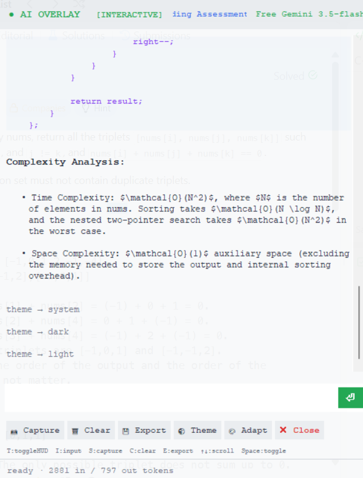
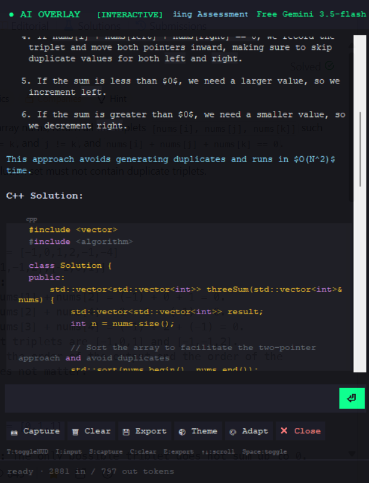
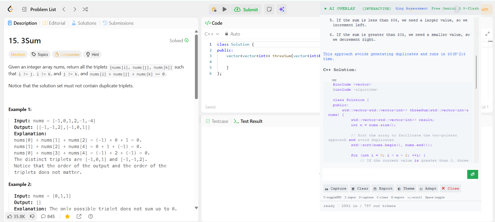
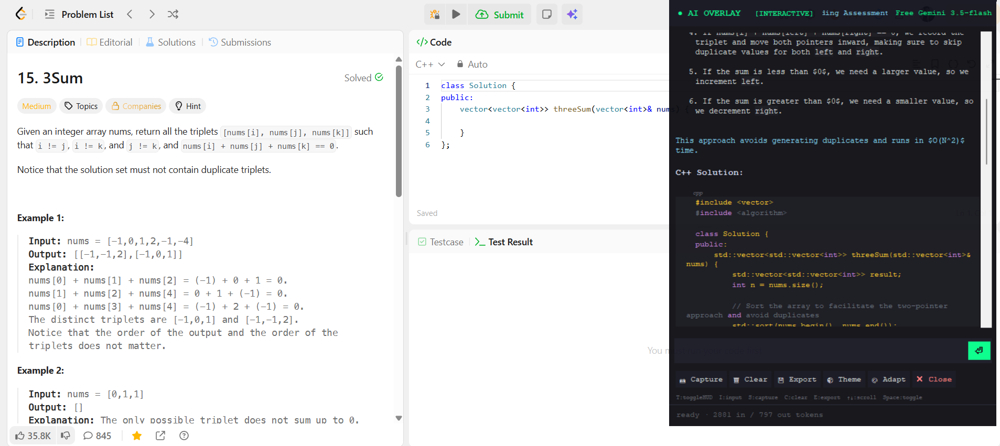

# 🤖 AIOverlayAgent

> **A free, open-source AI desktop overlay for developers, students, and professionals.**
>
> Instantly ask AI about anything on your screen using screenshots, global hotkeys, and your favorite AI models—without monthly subscriptions or vendor lock-in.

---

## 🌟 Why AIOverlayAgent?

Most desktop AI assistants require subscriptions, lock you into a single provider, or hide advanced features behind a paywall.

**AIOverlayAgent is different.**

* 🆓 **100% Free & Open Source (MIT)**
* 🔑 Bring your own API key
* 🤖 Works with multiple AI providers and models
* 💰 No subscriptions or recurring fees
* 🔒 Your API keys stay under your control
* ⚡ Lightweight, fast, and keyboard-first
* ❤️ Built by developers, for developers

Whether you're solving coding problems, debugging applications, studying, writing documentation, or using AI during meetings, AIOverlayAgent keeps AI assistance just one shortcut away.

---

### 🖼️ Screenshots

#### APP UI

<div style="display:flex; justify-content:center;">


</div>

#### 💻 LeetCode Answer Example

<div style="display:flex; justify-content:center; align-Items: center; flex-direction: column;">


</div>

---

## ✨ Features

* 🤖 AI desktop overlay that stays above other windows
* 📸 Screenshot-based AI assistance with multimodal models
* ⌨️ Powerful global keyboard shortcuts
* 🧠 Support for OpenRouter, OpenAI, Anthropic, and Gemini
* 🎨 AI-powered adaptive themes
* 📝 Beautiful Markdown rendering
* 📤 Export conversations to Markdown
* 👆 Click-through mode
* 👻 Capture exclusion & overlay utilities
* 💾 Local chat history
* 🔒 No account required
* ❤️ Fully open source

---

## 🚀 Perfect For

* 👨‍💻 Software Developers
* 🎓 Students
* 💼 Professionals
* 📚 Learning & Research
* 🧩 Competitive Programming
* 💻 LeetCode & DSA Practice
* 🐞 Debugging Code
* 🤖 AI-Assisted Workflows

---

## ❤️ Why Open Source?

AIOverlayAgent is built in the open so everyone can:

* 🔍 Inspect the source code
* 🛠️ Customize every feature
* 🚀 Build their own version
* 🐛 Report bugs
* 💡 Suggest improvements
* 🤝 Submit pull requests

Just an open-source AI desktop assistant that anyone can use.

---

## ⭐ Support the Project

If AIOverlayAgent helps you, you can support the project by:

* ⭐ Starring the repository
* 🍴 Forking the project
* 🐞 Reporting bugs
* 💡 Suggesting new features
* 🤝 Opening pull requests
* 📢 Sharing it with friends and fellow developers

Every star and contribution helps the project grow.

---

## 🐞 Issues & Feature Requests

Found a bug? Have an idea?

* 🐞 Open an **Issue** for bugs or unexpected behavior.
* 💡 Use **Discussions** for feature requests, questions, and ideas.
* 🚀 Pull requests are always welcome!

Please include reproduction steps, screenshots (if applicable), and your Windows version when reporting issues.

---

## 🚧 Roadmap

* ✅ Desktop AI Overlay
* ✅ Screenshot AI
* ✅ Multiple AI Providers
* ✅ Markdown Export
* ✅ AI Theme Adaptation
* 🚧 Voice Conversations
* 🚧 Real-time Meeting Assistant
* 🚧 Plugin System
* 🚧 OCR Improvements
* 🚧 Cross-platform Support

Community suggestions help decide what gets built next.

## 📋 Requirements

- 🪟 Windows 10 build 19041 or newer, or Windows 11.
- 🐍 Python 3.10 or newer for development.
- 🔑 An API key for at least one provider:
  - `OPENROUTER_API_KEY`
  - `OPENAI_API_KEY`
  - `ANTHROPIC_API_KEY`
  - `GEMINI_API_KEY`

## 🚀 Installation

```bat
git clone https://github.com/suryanshvermaa/personal-agent.git
cd personal-agent
py -3 -m venv .venv
.venv\Scripts\activate
pip install -r requirements.txt
```

Copy the environment template and add your provider key:

```bat
copy .env.example .env
```

Windows environment variables take priority over `.env`.

## 🛠️ Development Setup

Run the app from the repository root:

```bat
python main.py
```

The app starts directly. No activation step is required.

Useful files:

- `config.ini`: provider, model, UI, capture, and hotkey defaults.
- `app_config.ini`: app name, executable name, publisher, and version.
- `USER_GUIDE.html`: single-file browser documentation with copy buttons.
- `src/`: application code.
- `prompts/` and `src/prompts/`: prompt documentation and runtime prompt profiles.

## 📦 Build Instructions

Install build-only tools:

```bat
pip install -r requirements_build.txt
```

Build the standalone executable:

```bat
build\build_exe.bat
```

Build the Windows installer after the executable is created:

```bat
build\build_installer.bat
```

The installer build requires Inno Setup 6.

## 📖 Usage Guide

For a complete end-user guide, see [USER_GUIDE.html](USER_GUIDE.html).

1. 🚀 Start the app with `python main.py` or the packaged executable.
2. 🔄 Select a model from the header dropdown.
3. 💬 Type a question and send it.
4. 📸 Use screen capture when the model needs visual context.
5. 📤 Export the conversation to Markdown when needed.

Default hotkeys are configured in `config.ini`:

| Hotkey | Action |
| --- | --- |
| `Ctrl+Shift+Space` | Show or hide overlay |
| `Ctrl+Shift+S` | Capture screen |
| `Ctrl+Shift+Enter` | Send prompt |
| `Ctrl+Shift+E` | Export chat |
| `Ctrl+Shift+Alt+T` | Toggle click-through |

## 🔒 Privacy

Screenshots and prompts are sent to the AI provider you configure. Avoid capturing sensitive information unless you are comfortable sending it to that provider.

## 🤝 Contributing

Contributions are welcome. Read [CONTRIBUTING.md](CONTRIBUTING.md) before opening a pull request, and follow the [CODE_OF_CONDUCT.md](CODE_OF_CONDUCT.md).

## ❓ FAQ

### Does this project require activation?

No. All licensing and activation code has been removed.

### Which provider should I use?

OpenRouter is convenient if you want one key for multiple model vendors. Direct OpenAI, Anthropic, and Gemini integrations are also available.

### Where is user data stored?

By default, user data is stored in `%APPDATA%\AIOverlayAgent\`.

### Can I build an installer?

Yes. Use the build commands above and install Inno Setup 6 before running `build\build_installer.bat`.

### Does capture exclusion work everywhere?

No capture-exclusion approach is universal. Test with your target recording or screen-sharing tool before relying on it.

## 📄 License

This project is licensed under the MIT License. See [LICENSE](LICENSE).
